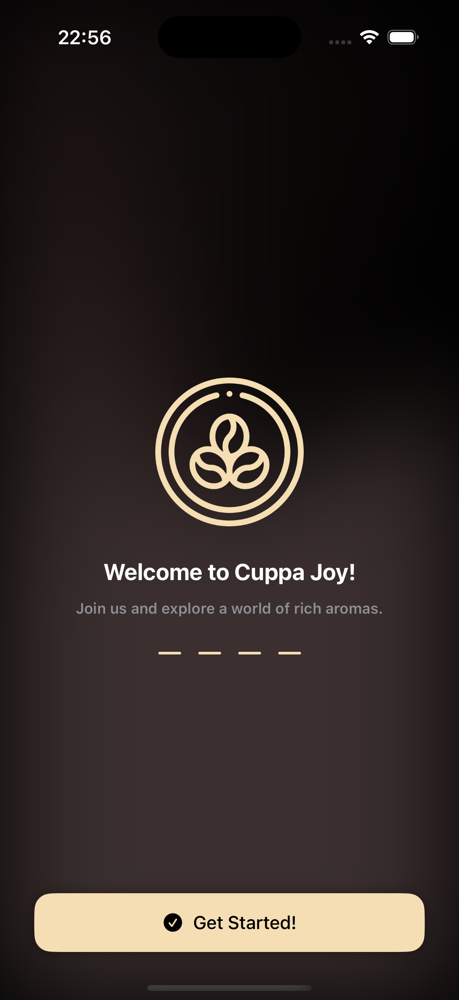
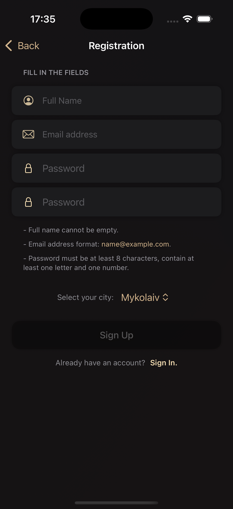
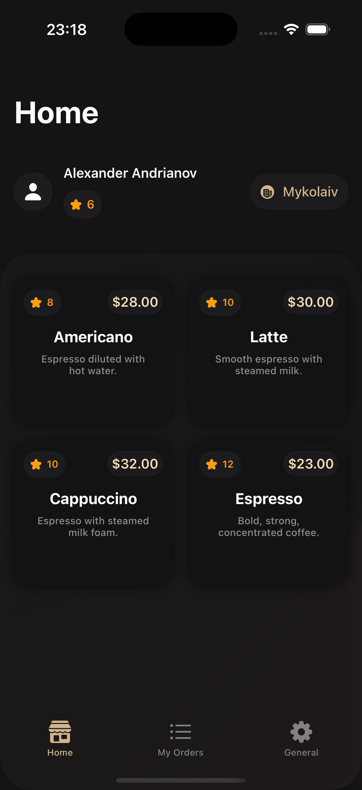
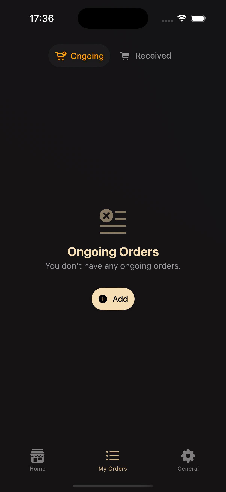
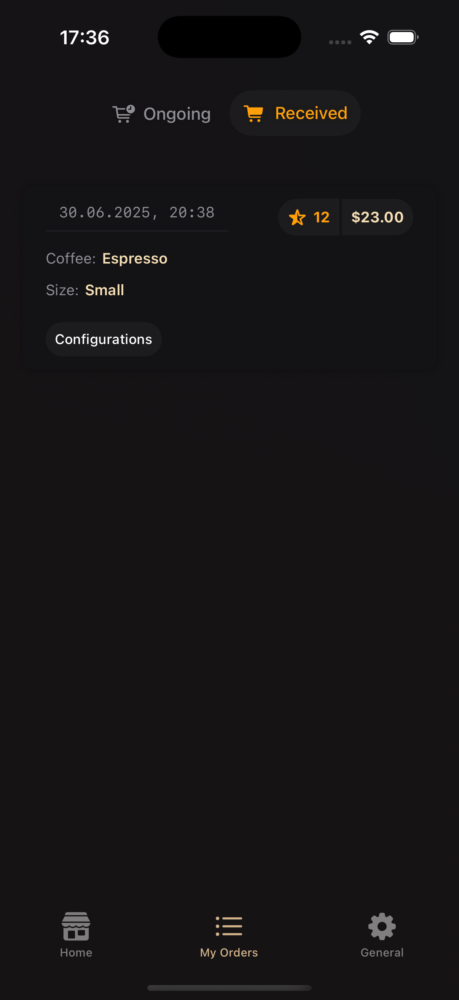
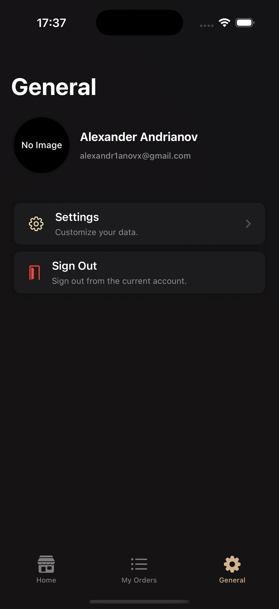
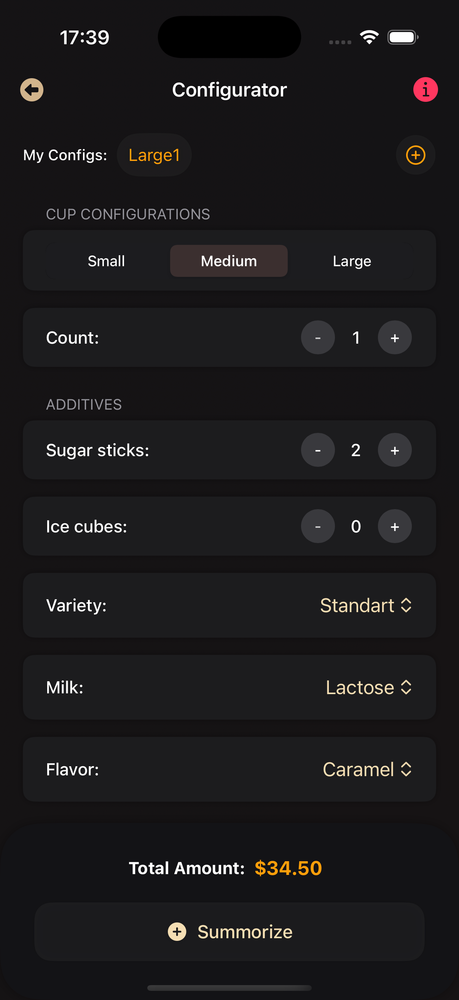
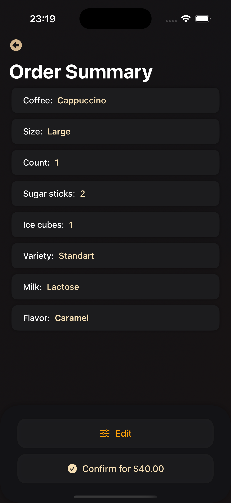
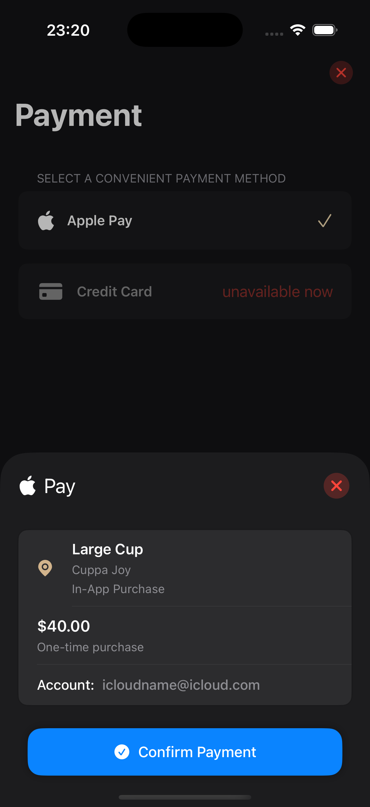

# ☕️ CuppaJoy

**CuppaJoy** is an iOS app for ordering coffee.

## Tech Stack

- Language: Swift.
- UI Framework: SwiftUI.
- Architecture: MVVM.
- Backend: Firebase (Authentication, Firestore).

## Features

- **coffee configs** – save your favorite coffee configurations to reorder them with a single tap.
- **orders history** – view your previous orders in a neatly organized "MyOrders" screen.

## Screenshots

  
  
  
  
  

  
  
  
  
  
  

