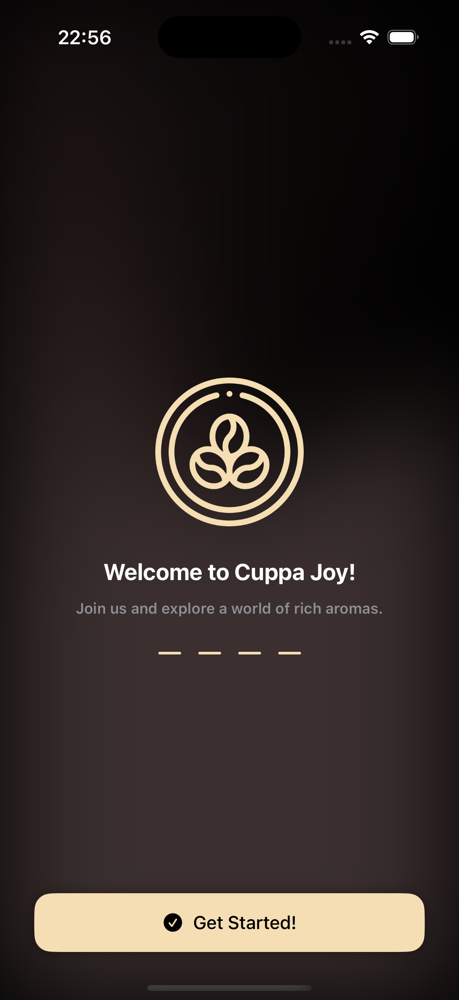
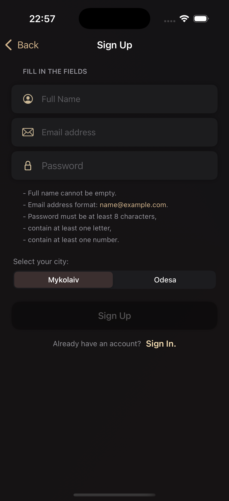
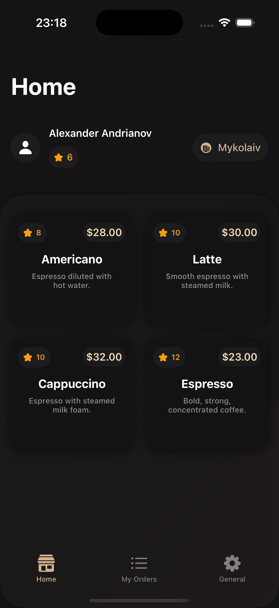
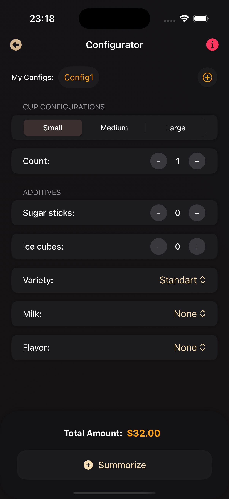
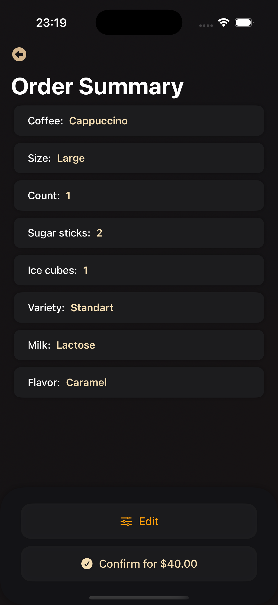

# ☕️ CuppaJoy

**CuppaJoy** is an iOS app for ordering coffee, built with SwiftUI using the MVVM architecture. It leverages Firebase Authentication for user login and Firebase Firestore for real-time cloud data storage and synchronization.

## Tech Stack

- Language: Swift.
- UI Framework: SwiftUI.
- Architecture: MVVM.
- Backend: Firebase (Authentication, Firestore).

## Features

- **favorite configs** – save your favorite coffee configs to reorder with a single tap.
- **order history** – view your previous orders in a neatly organized "MyOrders" screen.

## Screenshots

  
  
  
  
  

  
  
  

