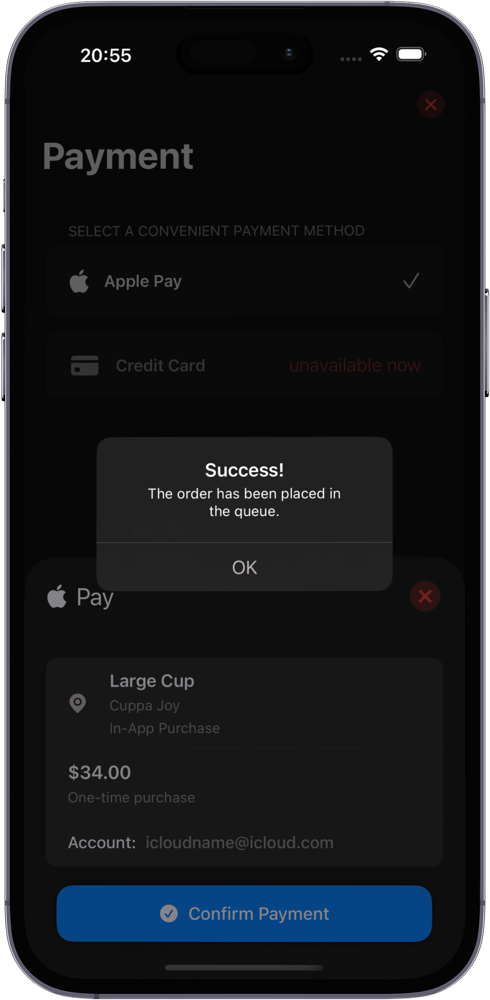

#  CuppaJoy

An iOS app designed for ordering coffee.  

**Features**
- save your favorite coffee configs to reorder coffee with a single tap.
- view your previous orders.

**iOS 17+**  

---

## Screenshots
<p align="center">
   
   
   
   
   
   
   
   
  
  
</p>

---

## Tech Stack  
- Swift
- SwiftUI
- MVVM
- async/await
- Firebase(Authentication, Firestore)
---

## Installation  
```bash
git clone https://github.com/alexandr1anov/LexiGrow.git
